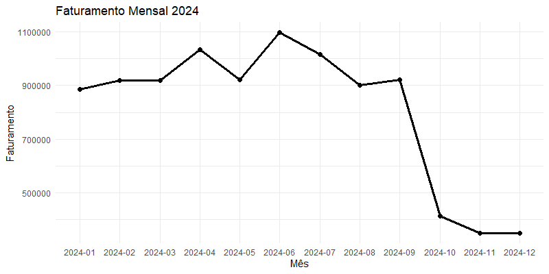
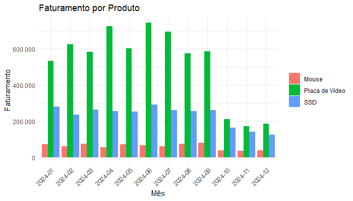
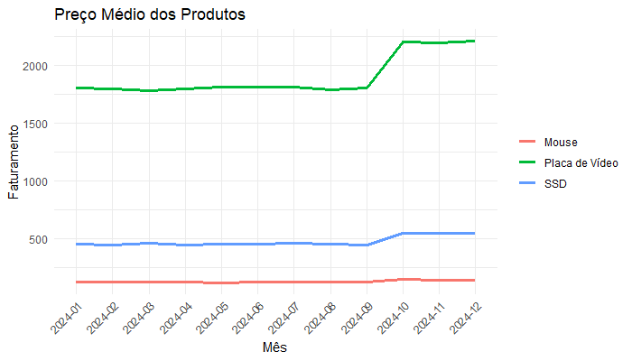

# 📊 Projeto Final: Análise de Queda nas Vendas — HashTech

Este projeto foi desenvolvido como aplicação prática dos conhecimentos em linguagem R, com foco em análise exploratória de dados.

---

## 🏢 Contexto

A HashTech é uma empresa que comercializa três produtos:

- Placa de Vídeo  
- SSD  
- Mouse  

Recentemente, a empresa identificou uma queda expressiva no faturamento e solicitou uma análise para entender suas causas.

---

## 🎯 Objetivo da Análise

Investigar os dados de vendas com o objetivo de:

- Identificar quando ocorreu a queda  
- Entender o que mudou no período  
- Levantar hipóteses baseadas em dados  

---

## 🛠️ Ferramentas Utilizadas

- R  
- dplyr  
- ggplot2  
- readr  

---

## 📊 Base de Dados

Os dados utilizados são simulados e representam as vendas ao longo de 2024.

A base está disponível na pasta `data/` deste repositório.

---

## 📈 Principais Insights

- O faturamento total da empresa apresentou uma queda significativa a partir de outubro de 2024.

- Ao analisar o faturamento por produto, observou-se que a queda está fortemente associada à categoria **Placa de Vídeo**, que apresentou redução expressiva no mesmo período.

- A análise de preço médio indicou que, a partir de outubro de 2024, houve um aumento significativo no preço das **Placas de Vídeo**.

---

## 💡 Hipóteses

- O aumento no preço médio das Placas de Vídeo pode ter impactado negativamente a demanda, contribuindo para a queda no faturamento.

- Como este é o produto com maior relevância no faturamento, sua variação impactou diretamente o resultado total da empresa.

---

## 📊 Visualizações

### Faturamento ao longo do tempo

### Faturamento por produto

### Preço médio ao longo do tempo

---

